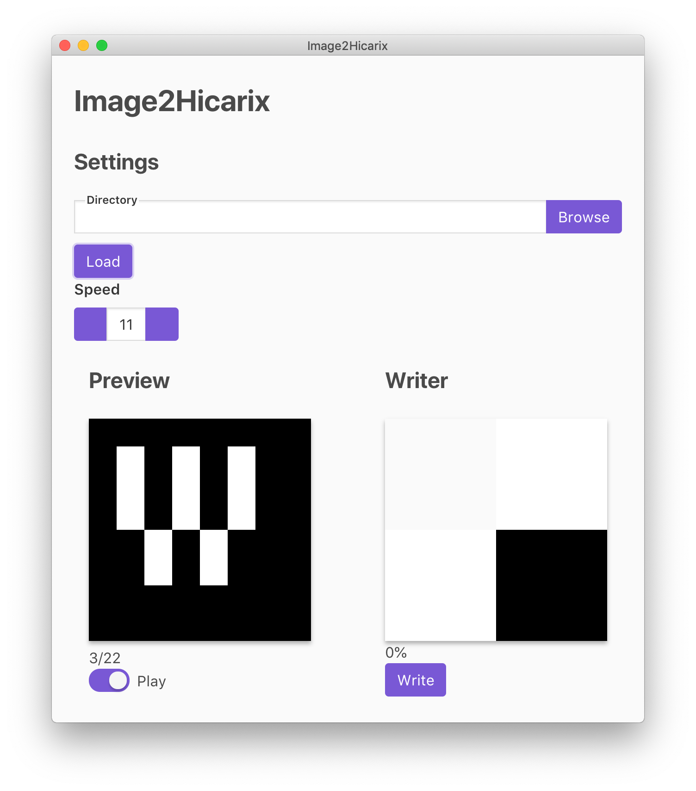

# Image2Hicarix

> Hicarix Badge writer



## これは何？

連番画像を[Hicarix Badge](https://hicarix.com/)に書き込むためのツールです。

Hicarix BadgeはLEDマトリクスをバッジとして鞄などに付けることのできるアイテムです。
本来はスマートフォンアプリのHicarix Appにて点滅パターンの編集・書き込みを行いますが、
Image2Hicarixを用いることで、PCで点滅パターンを編集し、書き込むことができます。

### 動作確認済み環境
* Windows 10
* macOS Mojave
* Ubuntu

### 使用方法

[Releases](https://github.com/wararyo/image2hicarix/releases)より最新バージョンをダウンロードします。  

お好きなソフトウェアでアニメーションを作成し、連番PNGとして書き出します。
8x8のグレースケールがおすすめです。  

書き出すディレクトリには連番画像以外のファイルが存在しないようにしてください。  
書き込む際に二階調化が行われるため、必ずしも白と黒のみである必要はありません。

点滅パターンを作成するのが面倒な場合は、`sequence-examples`フォルダにサンプルの点滅パターンを用意しているので、それを使うこともできます。

Image2Hicarixを起動し、Directoryに連番画像のあるディレクトリを指定します。
`Load`を押すと、連番画像が読み込まれ、Previewにて再生が開始されます。

Writerの正方形にWRITEモードのHicarix Badgeを重ねます。  
スイッチが左上になるようにしてください。

あとは`Write`ボタンを押し、書き込みが終了するまで待機すれば完了です。

## Build Setup

``` bash
# install dependencies
npm install

# serve with hot reload at localhost:9080
npm run dev

# build electron application for production
npm run build

```

---

This project was generated with [electron-vue](https://github.com/SimulatedGREG/electron-vue)@[8fae476](https://github.com/SimulatedGREG/electron-vue/tree/8fae4763e9d225d3691b627e83b9e09b56f6c935) using [vue-cli](https://github.com/vuejs/vue-cli). Documentation about the original structure can be found [here](https://simulatedgreg.gitbooks.io/electron-vue/content/index.html).
